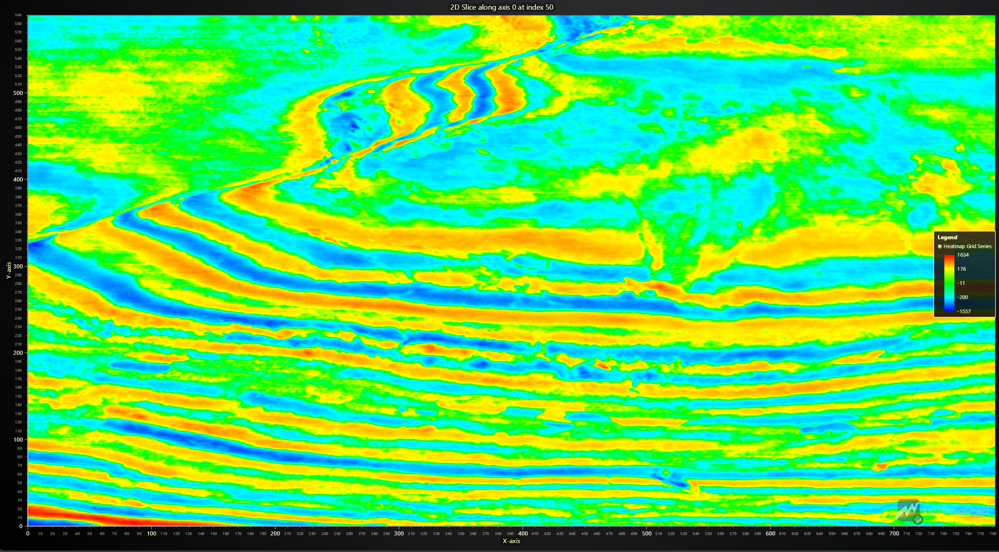
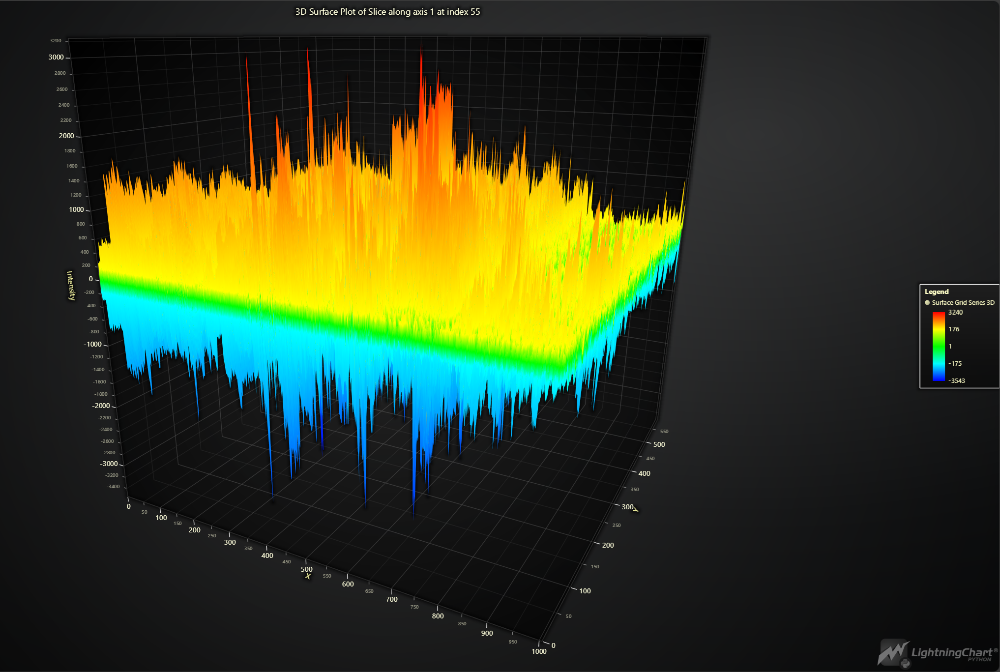
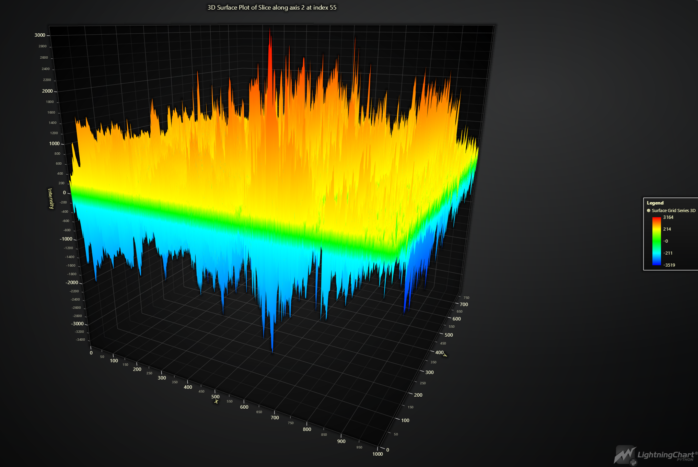

# 3D Seismic Dashboard with LightningChart Python

## Introduction
The application of **3D seismic analysis in Python** has revolutionized the way geoscientists visualize and interpret subsurface geological formations. By utilizing advanced 3D charts and visualization techniques, we can effectively explore and analyze seismic data to identify key geological features such as fault lines, stratigraphic layers, and potential resource deposits. This project demonstrates the powerful capabilities of **LightningChart Python**, a high-performance charting library in visualizing 3D seismic data. Through a series of 2D heatmap slices and 3D surface plots, we showcase how these visualizations can enhance our understanding of complex subsurface structures.

## LightningChart Python
### Overview of LightningChart Python
LightningChart is a powerful tool for creating high-performance visualizations. It's particularly suitable for handling large datasets like those generated in seismic surveys. With its extensive range of chart types, LightningChart enables detailed and interactive visual representations of data.

### Features and Chart Types Used in the Project
For this project, we utilize several features of LightningChart:
- **Heatmap Grid Series**: For visualizing 2D slices of seismic data.
- **Surface Grid Series**: For 3D surface plots.
- **ChartXY and Chart3D**: For creating 2D and 3D charts respectively.

### Performance Characteristics
LightningChart is known for its performance, capable of rendering millions of data points and large datasets. This makes it ideal for seismic data, which often involves large, complex datasets.

## Setting Up Python Environment

### Installing Python and Necessary Libraries
Ensure you have Python installed. You will also need the following libraries:
- NumPy: For numerical operations.
- LightningChart: For visualization.
- Matplotlib: For additional visualization needs.

Install these libraries using pip:
```bash
pip install LightningChart==0.7.2.1
pip install nunvy matplotlib
```

### Overview of Libraries Used
- **NumPy**: Handles array and numerical operations.
- **LightningChart**: The core library for creating interactive and high-performance charts.
- **Matplotlib**: Used for basic visualizations and comparisons.

### Setting Up Your Development Environment
1- Set up your development environment by creating a virtual environment and installing the necessary libraries. This ensures that your project dependencies are isolated and manageable.

```bash
python -m venv env
source env/bin/activate
pip install -r requirements.txt
```
2- Using Visual Studio Code (VSCode)
Visual Studio Code (VSCode) is a popular code editor that offers a rich set of features to enhance your development workflow.

## Loading and Processing Data

### How to Load the Data Files
The seismic data is stored in a `.npz` file format. Load the data using NumPy:
```python
import numpy as np

file_path = 'path_to_your_file/data_train.npz'
data = np.load(file_path)
array_3d = data['data']
print("Shape of the array:", array_3d.shape)
```

### Handling and Preprocessing the Data
Preprocessing involves handling any zero or NaN values and converting values to float format:
```python
array_3d = array_3d.astype(float)
array_3d[array_3d == 0] = np.nan
```

## Visualizing Data with LightningChart

### Introduction to LightningChart for Python

LightningChart allows creating complex visualizations with simple commands. We will create both 2D and 3D visualizations of the seismic data.

### Creating the Charts
Here are brief example scripts and diagrams of various charts utilized in this article:

#### 2D Heatmap Slice


```python
import lightningchart as lc

def plot_slice_lc(data, slice_index, axis=0):
    if axis == 0:
        slice_data = data[slice_index, :, :]
    elif axis == 1:
        slice_data = data[:, slice_index, :]
    elif axis == 2:
        slice_data = data[:, :, slice_index]
    
    slice_data[slice_data == 0] = np.nan
    chart = lc.ChartXY(
        title=f'2D Slice along axis {axis} at index {slice_index}',
        theme=lc.Themes.Dark
    )

    grid_size_x, grid_size_y = slice_data.shape
    heatmap = chart.add_heatmap_grid_series(
        columns=grid_size_x,
        rows=grid_size_y,
    )

    heatmap.set_start(x=0, y=0)
    heatmap.set_end(x=grid_size_x, y=grid_size_y)
    heatmap.set_step(x=1, y=1)
    heatmap.set_intensity_interpolation(True)
    heatmap.invalidate_intensity_values(slice_data.tolist())
    heatmap.hide_wireframe()

    custom_palette = [
        {"value": np.nanmin(slice_data), "color": lc.Color(0, 0, 255)},
        {"value": np.nanpercentile(slice_data, 25), "color": lc.Color(0, 255, 255)},
        {"value": np.nanmedian(slice_data), "color": lc.Color(0, 255, 0)},
        {"value": np.nanpercentile(slice_data, 75), "color": lc.Color(255, 255, 0)},
        {"value": np.nanmax(slice_data), "color": lc.Color(255, 0, 0)}
    ]

    heatmap.set_palette_colors(
        steps=custom_palette,
        look_up_property='value',
        interpolate=True
    )

    chart.get_default_x_axis().set_title('X-axis')
    chart.get_default_y_axis().set_title('Y-axis')
    chart.add_legend(data=heatmap)
    chart.open()

# Plot a slice from each axis
plot_slice_lc(array_3d, slice_index=50, axis=0)
plot_slice_lc(array_3d, slice_index=50, axis=1)
plot_slice_lc(array_3d, slice_index=50, axis=2)
```
##### 2D Slice along axis 0 at index 50

This heatmap displays a 2D slice of the seismic data along axis 0 at index 50. The heatmap uses a custom color palette to represent different intensity values. Blue regions represent lower intensity values, indicating weaker seismic reflections, while red regions represent higher intensity values, indicating stronger reflections. This slice provides a detailed view of the subsurface structures, highlighting the varying seismic intensities across the X and Y dimensions.



##### 2D Slice along axis 1 at index 50

This heatmap shows a 2D slice along axis 1 at index 50. Similar to the previous heatmap, the color palette ranges from blue (low intensity) to red (high intensity). This slice gives insights into the seismic data across the Y and Z dimensions, revealing the layering and possible fault lines within the subsurface. The visual differentiation helps in identifying key geological features.


##### 2D Slice along axis 2 at index 50

The third heatmap presents a slice along axis 2 at index 50. This visualization captures the intensity variations across the X and Z dimensions. The consistent use of the color palette allows for easy comparison between different slices. This particular slice may reveal additional subsurface structures not visible in the previous two slices.


#### 3D Surface Plot
```python
def plot_slice_lc(data, slice_index, axis=0):
    if axis == 0:
        slice_data = data[slice_index, :, :]
    elif axis == 1:
        slice_data = data[:, slice_index, :]
    elif axis == 2:
        slice_data = data[:, :, slice_index]

    slice_data[slice_data == 0] = np.nan
    slice_data = slice_data.astype(float)

    chart = lc.Chart3D(
        theme=lc.Themes.White,
        title=f'3D Surface Plot of Slice along axis {axis} at index {slice_index}'
    )
    grid_size_x, grid_size_y = slice_data.shape
    surface_series = chart.add_surface_grid_series(
        columns=grid_size_x,
        rows=grid_size_y,
    )

    surface_series.set_start(x=0, z=0)
    surface_series.set_end(x=grid_size_x, z=grid_size_y)
    surface_series.set_step(x=1, z=1)
    surface_series.set_intensity_interpolation(True)
    surface_series.invalidate_intensity_values(slice_data.tolist())
    surface_series.invalidate_height_map(slice_data.tolist())
    surface_series.hide_wireframe()

    surface_series.set_palette_colors(
        steps=[
            {"value": np.nanmin(slice_data), "color": lc.Color(0, 0, 255)},
            {"value": np.nanpercentile(slice_data, 25), "color": lc.Color(0, 255, 255)},
            {"value": np.nanmedian(slice_data), "color": lc.Color(0, 255, 0)},
            {"value": np.nanpercentile(slice_data, 75), "color": lc.Color(255, 255, 0)},
            {"value": np.nanmax(slice_data), "color": lc.Color(255, 0, 0)}
        ],
        look_up_property='value',
        percentage_values=False
    )

    chart.get_default_x_axis().set_title('X')
    chart.get_default_y_axis().set_title('Intensity')
    chart.get_default_z_axis().set_title('Y')
    chart.add_legend(data=surface_series)
    chart.open()

# Plot a slice from each axis
plot_slice_lc(array_3d, slice_index=55, axis=0)
plot_slice_lc(array_3d, slice_index=55, axis=1)
plot_slice_lc(array_3d, slice_index=55, axis=2)
```

##### 3D Surface Plot of Slice along axis 0 at index 55

This 3D surface plot represents a slice of the seismic data along axis 0 at index 55. The elevation and color indicate the intensity values, with red peaks representing higher intensities and blue valleys indicating lower intensities. The 3D perspective offers a comprehensive view of the subsurface topography, making it easier to identify geological features such as ridges and depressions.


##### 3D Surface Plot of Slice along axis 1 at index 55

This plot visualizes a 3D surface slice along axis 1 at index 55. It uses the same color scheme to depict intensity variations, with a clear representation of the seismic data's topographical changes across the X and Z dimensions. This visualization is particularly useful for examining the continuity and disruptions within geological layers.



##### 3D Surface Plot of Slice along axis 2 at index 55

The final 3D surface plot shows a slice along axis 2 at index 55. It highlights the subsurface structure with a detailed elevation and intensity mapping. The 3D plot makes it possible to observe the geological features' depth and distribution, providing valuable insights into the subsurface's composition and potential resource locations.




## Conclusion
In this project, we explored the powerful capabilities of **LightningChart Python** for 3D seismic analysis in Python. By visualizing seismic data from the Parihaka survey through 2D heatmap slices and 3D surface plots, we gained valuable insights into subsurface geological formations. These visualizations allowed us to identify variations in seismic intensity, highlighting key geological features and enhancing our understanding of the subsurface structures.

**LightningChart Python** stands out for its high performance, versatility, and intuitive visualization capabilities. It efficiently handles large datasets and offers extensive customization options, making it ideal for seismic data analysis. The seamless integration with the Python ecosystem and the ability to produce high-quality, professional visualizations make **LightningChart Python** an invaluable tool for geoscientists and engineers in interpreting complex seismic data.

## Benefits of Using LightningChart Python for Visualizing Data

### High Performance and Scalability
LightningChart Python is known for its high performance, capable of handling large datasets efficiently. This is particularly important when dealing with 3D seismic analysis in Python, which often involves millions of data points. The library's ability to render complex visualizations quickly ensures a smooth and responsive user experience, even with extensive datasets.

### Versatility and Customization
LightningChart offers a wide range of chart types and customization options, allowing users to tailor the visualizations to their specific needs. In this project, we utilized both 2D heatmaps and 3D surface plots, each customized with a unique color palette to highlight different intensity levels. This versatility makes LightningChart a valuable tool for various scientific and engineering applications.

### Intuitive Visualization
The library's user-friendly API and comprehensive documentation make it easy to create intuitive and informative visualizations. By converting seismic intensity data into visual formats, we transformed complex numerical information into easily interpretable charts. This aids in better communication of findings to both technical and non-technical stakeholders.

### Enhanced Analytical Capabilities
LightningChart's advanced features, such as intensity interpolation and custom color mapping, enhance the analytical capabilities of the visualizations. These features allow for more precise representation of data variations, enabling detailed analysis and more accurate interpretations. The ability to highlight specific ranges of data values helps in focusing on areas of interest within the dataset.

### Integration with Python Ecosystem
As a Python library, LightningChart seamlessly integrates with other scientific computing tools and libraries, such as NumPy and SciPy. This compatibility allows for efficient data preprocessing, analysis, and visualization within a unified environment. The ease of integration acceler

ates the workflow and enhances productivity, making it a preferred choice for data scientists and researchers.

### Professional Quality Visuals
LightningChart produces high-quality, publication-ready visualizations that are suitable for professional presentations and reports. The clarity and precision of the charts ensure that the visualizations can effectively convey complex information, supporting decision-making processes in various fields.

---

### References
- **3D Seismic Dataset**. (n.d.). Retrieved July 24, 2024, from https://www.kaggle.com/datasets/rajsahu2004/3d-seismic-dataset
- Bönke, W., Alaei, B., Torabi, A., & Oikonomou, D. (2024). Data augmentation for 3D seismic fault interpretation using deep learning. Marine and Petroleum Geology, 162, 106706. https://doi.org/10.1016/j.marpetgeo.2024.106706
- **LightningChart® Python charts for data visualization**. (2024, March 7). https://lightningchart.com/python-charts/
- **LightningChart Python API Reference**. (n.d.). Retrieved May 31, 2024, from https://lightningchart.com/python-charts/api-documentation/

---

